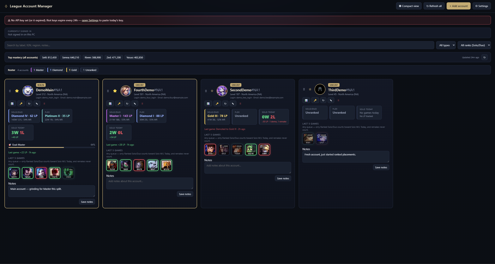
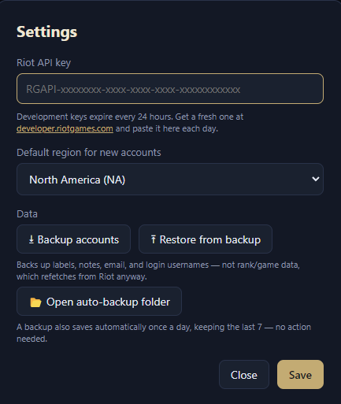
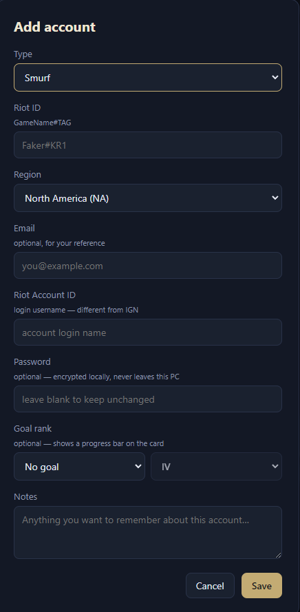

# League Account Manager

A desktop app (Electron) for tracking your League of Legends **main and smurf accounts**
side by side. Nothing is uploaded anywhere except requests to Riot's official API to
read your public match/rank data — everything else stays on your machine.



## Features

- **IGN**, profile icon, level, and **rank** (Solo/Duo + Flex, tier/division/LP/WR)
- **Last 5 games** — green/red border for win/loss, hover for KDA
- **Daily Solo/Duo W/L** and a running **Net LP today** total
- **Active account widget** — shows who's currently signed in to the League Client on
  this PC, live, with an auto-refresh the moment their game ends
- **Blue Essence, RP, champions owned, and skins owned** — read from the League Client
  while an account is signed in on this PC (Riot's public API doesn't expose these),
  then kept on the card afterwards. Click the Champs/Skins chip for a searchable
  picture grid of everything that account owns
- **Notes**, **goals** (target rank, showing live LP-to-go), **favorites**, drag-to-reorder,
  compact/wide view
- **Manual + automatic backups**, and one-click "copy login + launch client" sign-in
- **Collective mastery widget** — top 5 champions by combined mastery across all accounts
- Search/filter by label, IGN, region, email, login, or notes

## Install

Grab the latest installer from
**[Releases](https://github.com/BellyBop/League-Account-Manager/releases/latest)**
(`LeagueAccountManager-Setup-x.x.x.exe`), run it, and launch the app — no Node or
npm required. Windows may show an "unrecognized app" SmartScreen prompt since the
installer isn't code-signed; click **More info → Run anyway**.

From here on the app updates itself: it checks GitHub Releases on launch and every
few hours, downloads a newer version in the background, and shows a "restart to
apply" banner when it's ready (installing on quit either way). Turn off
**⚙ Settings → Automatically check for updates** to only check when you click the
**Check for updates** link there.

### Running from source instead

```bash
npm install
npm start
```

### Building the installer yourself

```bash
npm install
npm run dist
```

Produces `dist/LeagueAccountManager-Setup-x.x.x.exe` via `electron-builder`
(unsigned — see the SmartScreen note above). A release also needs the generated
`dist/latest.yml` uploaded alongside the `.exe` for the in-app updater to see it.

### Add your Riot API key (required)

1. Sign in at <https://developer.riotgames.com/>
2. Copy the **Development API Key** (starts with `RGAPI-`)
3. In the app, open **⚙ Settings**, paste it, and Save

> Development keys expire every 24 hours — the app warns you (in-app and via desktop
> notification) shortly before yours does. For longer-lived access, apply for a
> "Personal" key on the same portal.



## Adding accounts

Click **+ Add account** and fill in a label (Main/Smurf), Riot ID (`GameName#TAG`),
region, and optionally email/login username/notes. The card fills in rank and match
data automatically; use **↻** to refresh.



## Good to know

- **Sign-in:** the **🔑** button copies that account's login username and launches the
  Riot Client — Riot has no public login API, so pasting your password is still manual.
  Optionally save a password per account (Edit → Password) and a **🔒** button appears
  to copy it too — it's encrypted at rest via the OS (Windows DPAPI/macOS Keychain/Linux
  libsecret, never a key stored in this app), decrypted straight to the clipboard from
  the main process, and never auto-typed or submitted into the client for you. The
  clipboard clears itself ~30s later, and saved passwords are excluded from backups
  (they're tied to this machine's OS account, so they wouldn't decrypt elsewhere anyway).
- **Sign out:** the active-account bar gets a **Sign out** button whenever someone's
  signed in on this PC. It's a real logout via the Riot Client's own local API (not a
  process kill) — the client reacts on its own and drops to its login screen, no
  relaunch needed, so you can switch straight to a different account. Riot Client
  refuses to sign out while League is still open, so this closes League first
  (gracefully, via its own shutdown command) — if you're in champion select or a
  match when you click it, that disconnects you and may count as leaving.
- **Backups:** **⚙ Settings → Backup accounts** exports your labels/notes/emails/logins
  (not rank data, which is refetched from Riot) to a JSON file. Automatic daily backups
  also go to `<userData>/auto-backups` (last 7 kept).
- **Keyboard shortcuts:** `Ctrl+F` search, `Ctrl+N` add account, `Ctrl+R` refresh all,
  `Ctrl+=`/`Ctrl+-`/`Ctrl+0` (or `Ctrl`+scroll) to zoom in/out/reset — remembered
  between launches.
- **Net LP today** only counts games the app was open for start-to-finish, so it can
  undercount on a day the app wasn't running the whole time — the W/L count above it is
  always complete since it's rebuilt from real match history instead.

## Project layout

- `main.js` — Electron entry point: window setup, IPC registration, background timers
- `ipc/` — one file per IPC domain (settings, accounts, Riot data, mastery, backup,
  League Client, updates), each exposing a `registerXIpc()`
- `lib/` — domain logic: storage, rank math, match history, goals, notifications,
  mastery, backups, auto-update, and the local League Client (LCU) integration
- `riot.js` — all outbound Riot API calls and region routing; the API key never leaves
  the main process
- `preload.js` — the sandboxed bridge between the UI and the main process
- `src/` — the UI (`index.html`, `styles.css`, `renderer.js`); plain script, no bundler

Your data lives in Electron's per-user app data folder (`%APPDATA%/league-acc-manager/`
on Windows) as `settings.json`, `accounts.json`, `mastery.json`, and `matchCache.json` —
never inside the project folder itself.

